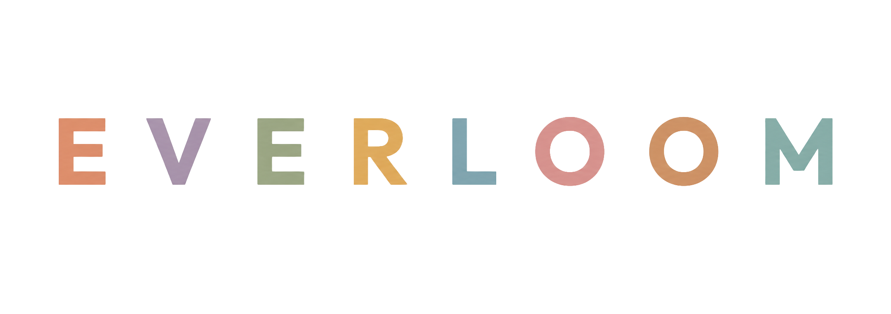
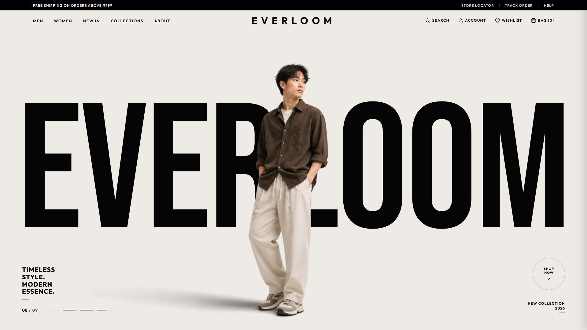

<p align="center">
  
</p>

<h1 align="center">EVERLOOM</h1>
<p align="center"><i>Timeless Style. Modern Essence.</i></p>

<p align="center">
  
</p>

<p align="center">
  
  
  
  
  
</p>

---

**EVERLOOM** is a luxury fashion e-commerce experience built with a high-fashion editorial aesthetic and a fully custom vanilla architecture.

Designed to feel like a premium fashion brand website, EVERLOOM combines immersive animations, interactive product discovery, smooth transitions, and a responsive shopping experience — all without React or external UI frameworks.

## ✨ Features

### 🎨 Premium Visual Experience
- Luxury dark-mode design system with gold accents
- Editorial-style hero section with animated model carousel
- Custom glassmorphism overlays and UI transitions
- Responsive layouts optimized for desktop, tablet, and mobile

### ⚡ Interactive Plasma Engine
- Dynamic fashion model carousel powered by vanilla JavaScript
- 9 interchangeable model cutouts
- Directional slide animations with smooth transitions
- Auto-play slideshow with progress tracking
- Touch/swipe support for mobile devices

### 🛍️ E-Commerce Functionality
- Dynamic product catalog rendering
- Category-based product filtering
- Full-screen product search experience
- Interactive shopping bag drawer
  - Add/remove items
  - Quantity controls
  - Real-time subtotal calculation
  - Free shipping progress indicator

### 📱 Responsive Experience
- Mobile-first architecture
- Custom hamburger navigation
- Touch gesture interactions
- Adaptive layouts across screen sizes

---

## 🛠️ Tech Stack

| Category | Stack |
|---|---|
| **Core** | HTML5, CSS3, Vanilla JavaScript (ES6+) |
| **Animation** | [GSAP](https://greensock.com/gsap/) v3.12.5 |
| **Fonts** | Bebas Neue, Outfit, Plus Jakarta Sans |
| **UI** | Custom inline SVG icons, CSS Grid & Flexbox, Glassmorphism components |

---

## 📂 Project Structure

```
EVERLOOM/
│
├── index.html          # Main application structure
├── style.css            # Design system and animations
├── app.js               # Application logic and interactions
│
├── media/
│   ├── products/         # Product photography
│   └── banners/           # Editorial images
│
├── plasma/
│   ├── loger.png          # Brand logo
│   ├── previewer.png      # README preview image
│   └── *.png               # Fashion model cutouts
│
├── server.ps1           # Local PowerShell server
├── netlify.toml          # Netlify configuration
└── vercel.json            # Vercel deployment config
```

---

## 🚀 Quick Start (Local Server)

No build process or package installation required.

**Option 1 — PowerShell**
```powershell
powershell -ExecutionPolicy Bypass -File .\server.ps1
```

**Option 2 — Python**
```bash
python -m http.server 8085
```

**Option 3 — Node / NPX**
```bash
npx serve -p 8085
```

Then open:
```
http://localhost:8085
```

---

## ⚡ Deployment

### Vercel
1. Import this repository into Vercel.
2. Vercel automatically detects the static configuration.
3. Click **Deploy**.

### GitHub Pages
1. Push this repository to GitHub.
2. Go to `Settings → Pages`.
3. Select `Branch: main`, `Folder: /(root)`.
4. Save and deploy.

---

## 🔒 Performance & Optimization

- Zero framework overhead
- No build pipeline required
- Lightweight vanilla JavaScript architecture
- Optimized static asset delivery
- Long-term caching configured for media assets
- Security headers enabled for deployment

---

## 🎯 Design Philosophy

EVERLOOM was created around the idea of blending traditional luxury fashion aesthetics with modern web interactions.

The goal was to create a digital storefront that feels less like a typical e-commerce website and more like an immersive fashion editorial experience.

> **Timeless design. Modern interaction. Pure web craftsmanship.**

---

## 📜 License

This project is created for showcase and educational purposes.
